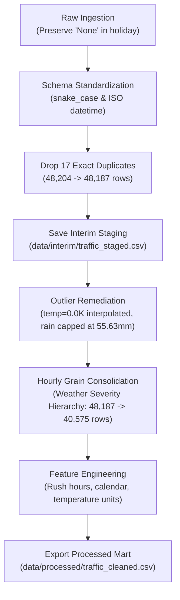
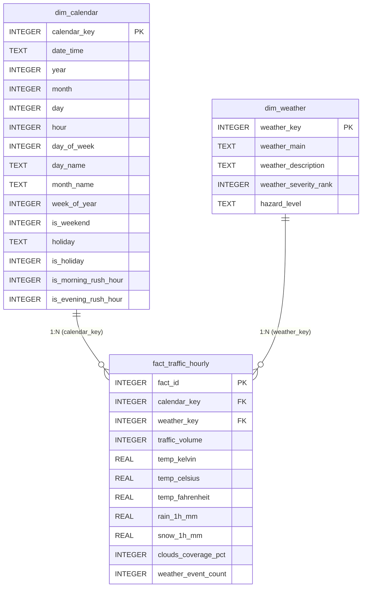

# Urban Mobility & Traffic Intelligence

An end-to-end industrial data engineering, time-series forecasting, and business intelligence analytics platform analyzing real-world interstate traffic volume, meteorological conditions, and temporal drivers.

---

## 1. Project Objective

The primary objective of the **Urban Mobility & Traffic Intelligence** platform is to ingest, audit, clean, model, and forecast hourly traffic volume along the high-density westbound corridor of Interstate 94 (I-94) connecting Minneapolis and St. Paul, Minnesota.

By analyzing the non-linear interactions between atmospheric phenomena (precipitation, temperature extremes, snowfall, cloud cover), temporal seasonality (hour-of-day, day-of-week, seasonal cycles), and holiday occurrences, the project:
- Establishes a rigorous, single-source-of-truth data warehousing foundation.
- Quantifies traffic throughput degradation and highway capacity variance under adverse weather.
- Develops predictive time-series forecasting models to anticipate traffic congestion.
- Delivers an executive-ready Power BI dashboard providing actionable mobility intelligence for municipal transit planners, operations managers, and logistics dispatchers.

---

## 2. Project Status & Roadmap

| Phase | Description | Status |
| :--- | :--- | :--- |
| **Phase 1** | **Project Foundation, Architecture & Forensic Dataset Audit** | **COMPLETED** (Approved) |
| **Phase 2** | **Data Cleaning, Feature Engineering, EDA & SQL Mart Preparation** | **COMPLETED** (Approved) |
| **Phase 3** | **Advanced SQL Analytics & Relational Dimensional Warehousing** | **COMPLETED** (Approved) |
| **Phase 4** | **Time-Series Forecasting & Predictive ML Modeling** | **COMPLETED** (Approved) |
| **Phase 5** | **Executive Intelligence & Portfolio Dashboard** | **COMPLETED** (Production Ready) |

---

## 3. Ground Truth Architecture & Tiered Storage

The raw dataset is maintained as an immutable single source of truth. All transformations flow unidirectionally through structured storage tiers:

```
[data/raw/]  ------------------->  [data/interim/]  ------------------->  [data/processed/]
Raw CSV (Immutable)                Deduplicated Staging                   Clean Analytical Mart
• 48,204 rows, 9 cols             • 48,187 rows, 9 cols                  • 40,575 rows, 24 cols
• Multi-event grain                • Multi-event grain                    • Strict 1-row-per-hour grain
• 17 exact duplicates              • Outliers flagged                     • Outliers resolved & imputed
• Zero modifications               • Preserves raw audit trace            • 15 engineered features
```

### Dataset Ground Truth Details
- **Canonical File Location:** `data/raw/Metro_Interstate_Traffic_Volume.csv`
- **File Format:** UTF-8 Comma-Separated Values (CSV), 3,237,208 bytes (~3.09 MB)
- **SHA-256 Checksum:** `749c90d720360a4215bb15345526073c079ba4cc95e3fa558796d083f85fce9e` (Pristine, unmodified)
- **Sensor Location:** Minnesota Department of Transportation (MN DoT) ATR Station 301 (Westbound I-94).
- **Atmospheric Source:** Collocated National Weather Service automated meteorological station.

---

## 4. Phase 2 Cleaning & Feature Engineering Workflow

The production pipeline is implemented in `src/clean_dataset.py`.



### 4.1 Duplicate-Handling Strategy & Dataset Grain
- **Exact Full-Row Duplicates:** Exactly 17 rows where all 9 fields were identical were identified and dropped.
- **Concurrent Timestamp Observations:** After dropping exact duplicates, 5,430 timestamps appeared multiple times (13,042 rows). Forensic inspection proved that **`traffic_volume` differed in 0 instances (0%)** across duplicate timestamps. The multiple rows represented multiple simultaneous weather observations (e.g., Rain + Mist).
- **Consolidation Rule & Actual Grain:** Timestamps were consolidated into **strictly one row per OBSERVED hourly timestamp (40,575 records)**:
  - The dataset covers **observed hours only**, NOT all calendar hours. The 11,976 missing historical hours (including the 307-day blackout) were intentionally NOT synthetically imputed, preserving ground truth.
  - `traffic_volume`: Invariant single value preserved (eliminating 23,553,076 double-counted phantom vehicles).
  - `holiday`: Invariant value preserved.
  - `temp`: Arithmetic mean of hourly readings.
  - `rain_1h` & `snow_1h`: Peak recorded hourly intensity (`max`).
  - `weather_main` & `weather_description`: Dominant condition selected via the deterministic **Weather Severity Hierarchy** (`Thunderstorm` > `Squall` > `Snow` > `Rain` > `Drizzle` > `Fog` > `Mist` > `Haze` > `Smoke` > `Clouds` > `Clear`).
  - `weather_event_count`: Audit column tracking how many raw weather observations occurred during that hour.

### 4.2 Outlier-Handling Strategy
1. **Absolute Zero Temperature (`temp == 0.0 K` in 10 records):** Sensor signal dropouts on 2014-01-31 and 2014-02-02. The surrounding temperature is ~255.5 K (-17.6 °C) and traffic volume is normal commuter flow (up to 5,150 vehicles/hr). Records were retained and temperatures imputed using localized linear time-series interpolation.
2. **Extreme Precipitation Anomaly (`rain_1h == 9831.30 mm` in 1 record):** Row 24872 on 2016-07-11 recorded an impossible 9.8 meters of rain during a thunderstorm. The record was capped at the dataset's maximum legitimate rainfall observation (**55.63 mm**).
3. **Zero Traffic Volume (`traffic_volume == 0` in 2 records):** Occurred on Saturday 2016-07-23 during severe thunderstorms and dense fog. Surrounding hours logged only 0 to 24 vehicles/hr. Retained as valid road closure / emergency detour edge cases.

---

## 5. Processed Dataset Feature Catalog (24 Features)

The processed dataset is saved at `data/processed/traffic_cleaned.csv` (40,575 rows, 24 columns):

| Column Name | Data Type | Role & Description |
| :--- | :--- | :--- |
| `date_time` | datetime64[ns] | Primary temporal timestamp (Hourly grain, YYYY-MM-DD HH:MM:SS) |
| `holiday` | object (str) | Holiday label (e.g. `'Labor Day'`) or `'None'` for normal days |
| `temp` | float64 | Ambient temperature in Kelvin (imputed for dropouts) |
| `rain_1h` | float64 | Hourly liquid precipitation in mm (capped at 55.63 mm) |
| `snow_1h` | float64 | Hourly snowfall accumulation in mm |
| `clouds_all` | int64 | Sky cloud cover percentage (0 to 100%) |
| `weather_main` | object (str) | Dominant macro weather category (11 classes) |
| `weather_description` | object (str) | Normalized lowercase granular weather description |
| `traffic_volume` | int64 | **Primary Target Metric:** Westbound vehicular volume count |
| `weather_event_count` | int64 | Number of raw meteorological events logged during the hour |
| `year` | int64 | Calendar year (2012 to 2018) |
| `month` | int64 | Calendar month number (1 to 12) |
| `day` | int64 | Day of month (1 to 31) |
| `hour` | int64 | Hour of day (0 to 23) |
| `day_of_week` | int64 | Day of week index (0 = Monday, 6 = Sunday) |
| `day_name` | object (str) | Day of week name ('Monday', 'Tuesday', etc.) |
| `month_name` | object (str) | Month name ('January', 'October', etc.) |
| `week_of_year` | int64 | ISO calendar week number (1 to 53) |
| `is_weekend` | int64 | Binary indicator: 1 for Saturday/Sunday, 0 for Monday-Friday |
| `is_holiday` | int64 | Binary indicator: 1 for official holidays, 0 for normal days |
| `is_morning_rush_hour`| int64 | Binary indicator: 1 if non-holiday weekday and hour in [6, 7, 8, 9] |
| `is_evening_rush_hour`| int64 | Binary indicator: 1 if non-holiday weekday and hour in [15, 16, 17, 18] |
| `temp_celsius` | float64 | Ambient temperature converted to Celsius |
| `temp_fahrenheit` | float64 | Ambient temperature converted to Fahrenheit |

---

## 6. Exploratory Data Analysis & Key Findings

The comprehensive EDA is documented in `notebooks/01_exploratory_data_analysis.ipynb` and `reports/eda_summary.md`. All 12 analytical figures are stored in `reports/figures/`:

1. **Bimodal Traffic Volume Distribution:** Mean is 3,290.65 vehicles/hr; median is 3,427.00 vehicles/hr. Characterized by an overnight lull cluster (< 800) and daytime commuter cluster (> 4,500).
2. **Diurnal Commuter Signature:** Night nadir occurs at 03:00 (373.21 vehicles/hr). Traffic surges into a morning crest at 07:00 (4,740.20) and peaks in the evening at 16:00 (5,708.61).
3. **Weekly Volume Profile:** Friday (3,674.78) and Thursday (3,653.91) exhibit the highest travel volumes. Weekends contract significantly: Saturday averages 2,822.56 and Sunday averages 2,426.25 (-34.0% vs Friday).
4. **Commuter Rush Hours vs. Off-Peak:**
   - Morning Rush (06:00–09:00 Mon–Fri): **5,463.33** vehicles/hr (+110.3% vs Weekday Off-Peak)
   - Evening Rush (15:00–18:00 Mon–Fri): **5,544.75** vehicles/hr (+113.4% vs Weekday Off-Peak)
   - Weekday Off-Peak: **2,598.01** vehicles/hr
   - Weekend Operations: **2,623.93** vehicles/hr
5. **Weather Throughput Degradation:** Severe conditions noticeably suppress interstate volume: Squalls reduce traffic to 420 vehicles/hr (-87%), dense fog reduces throughput to 2,653.77 (-19.4% vs Clear), and heavy rain downpours reduce volume by ~9.7%.
6. **Timeline Completeness:** Confirmed steady longitudinal baseline between 3,200 and 3,500 vehicles/hr with an extended **307-day collection blackout between August 2014 and June 2015**.

---

## 7. SQL Dimensional Mart & Advanced Relational Analytics (Phase 3)

Phase 3 transitions the analytical pipeline into an enterprise-grade Kimball dimensional star schema and implements comprehensive SQL analytics, window functions, and business KPIs.



### 7.1 Relational Architecture & Deliverables (`sql/`)
- **`sql/01_create_schema.sql`:** DDL establishing the Kimball star schema (`dim_calendar`, `dim_weather`, `fact_traffic_hourly`, `staging_traffic_cleaned`), including foreign keys, integrity constraints, optimized B-Tree indexes, and staging ingestion procedures.
- **`sql/02_data_dictionary.sql`:** Universal executable metadata catalog table (`data_dictionary_metadata`, 33 rows) providing formal business definitions, data types, physical constraints, and descriptions for every warehouse attribute.
- **`sql/03_analysis_views.sql`:** 14 high-performance analytical views answering foundational mobility questions:
  1. `vw_hourly_traffic_profile` (24-hour diurnal profile)
  2. `vw_morning_vs_evening_rush` (Rush-hour commuter benchmark)
  3. `vw_weekday_vs_weekend_traffic` (Weekday vs. weekend throughput)
  4. `vw_day_of_week_traffic` (7-day travel pattern)
  5. `vw_monthly_seasonality` (12-month annual curve)
  6. `vw_weather_impact` (11 macro weather conditions)
  7. `vw_weather_severity_impact` (Ordered by meteorological hazard rank)
  8. `vw_traffic_volume_rankings` (Busiest and lightest days ranked)
  9. `vw_peak_traffic_periods` (Severe congestion periods $\ge$ 6,000 veh/hr)
  10. `vw_low_traffic_periods` (Free-flow / nocturnal periods $\le$ 500 veh/hr)
  11. `vw_traffic_variability` (Hourly standard deviation and coefficient of variation)
  12. `vw_temperature_vs_traffic` (5 thermal bands from extreme cold to summer heat)
  13. `vw_rain_vs_traffic` (4 precipitation intensity tiers)
  14. `vw_weather_event_frequency` (Hourly meteorological multi-event concurrency)
- **`sql/04_advanced_analytics.sql`:** 6 advanced SQL scripts utilizing window functions (`LAG()`, `AVG() OVER()`, `ROW_NUMBER()`, `DENSE_RANK()`), multi-level CTEs, and statistical dispersion algorithms:
  - Hour-over-hour traffic surge and drop detection
  - 24-hour and 7-day trailing moving averages
  - Day-over-day same-hour throughput differential ($t - 24$)
  - Annual top peak hours ranked by volume
  - Adverse weather rush-hour capacity reduction analysis
  - Inter-day traffic volume volatility index
- **`sql/05_business_kpis.sql`:** Master executive KPI scorecard query and `vw_executive_kpi_summary`.
- **`sql/traffic_intelligence.db`:** Fully populated, query-ready SQLite database (18.7 MB, 40,575 fact rows, 0 orphan keys).
- **`src/validate_sql_db.py`:** Automated database builder and validator that populates the schema and verifies all views and row counts.
- **Documentation:** Comprehensive architectural documentation in `reports/dimensional_model.md` and query results report in `reports/sql_analysis_report.md`.

---

## 8. Time-Series Forecasting & Predictive ML Modeling (Phase 4)

Phase 4 delivers an industrial-grade, leakage-safe machine learning forecasting pipeline predicting next-hour traffic volume ($y_t$) using only past information available prior to hour $t$.

### 8.1 Leakage-Safe Feature Engineering (`src/features.py`)
- **Exact Timestamp Lag Matching:** Every lag (`traffic_lag_1h`, `traffic_lag_2h`, `traffic_lag_3h`, `traffic_lag_4h`, `traffic_lag_6h`, `traffic_lag_12h`, `traffic_lag_24h`, `traffic_lag_48h`, `traffic_lag_168h`) is looked up using exact historical timestamp matching (`date_time - timedelta`). Missing hours and observations across the 307-day blackout yield `NaN`, preventing false continuity.
- **Past-Only Rolling Statistics:** Computed over physical time intervals with `closed='left'`, strictly excluding the current observation $t$ (`traffic_roll_mean_6h`, `std_6h`, `min_6h`, `max_6h`, `mean_24h`, `std_24h`, `min_24h`, `max_24h`, `mean_168h`, `std_168h`).
- **Cyclical Temporal Encodings:** Continuous sine/cosine transforms for hour-of-day, day-of-week, and month.
- **Weather Regressors:** Temperature (Celsius), rain accumulation, snowfall, cloud cover percentage, and ordinal weather severity rank (1–11).

### 8.2 Chronological Split & Isolation
- **Train Split:** `2012-10-02 09:00:00` to `2017-09-30 23:00:00` (**31,842 rows**, 78.48%)
- **Validation Split:** `2017-10-01 00:00:00` to `2018-03-31 23:00:00` (**4,347 rows**, 10.71%)
- **Held-Out Test Split:** `2018-04-01 00:00:00` to `2018-09-30 23:00:00` (**4,386 rows**, 10.81%, **completely untouched** until final evaluation)

### 8.3 Model Performance on Held-Out Test Set (2018-04-01 to 2018-09-30)

| Model / Baseline | MAE (veh/hr) | RMSE (veh/hr) | sMAPE (%) | $R^2$ | Test Records ($N$) | Improvement vs. Seasonal Naive |
| :--- | :---: | :---: | :---: | :---: | :---: | :---: |
| **Past-Only Moving Average (24h)** | 1,713.80 | 1,953.42 | 60.94% | 0.0257 | 4,386 | Baseline |
| **Naive Persistence (1h)** | 585.89 | 813.69 | 25.82% | 0.8308 | 4,382 | Baseline |
| **Seasonal Naive (24h)** | 540.22 | 1,019.98 | 20.48% | 0.7341 | 4,380 | Strongest Baseline (0.00%) |
| **SARIMAX Parametric Benchmark** | 2,605.46 | 3,124.73 | 133.47% | -1.7851 | 383 | Parametric Baseline |
| **LightGBM Regressor** | 134.31 | 203.24 | 5.66% | 0.9895 | 4,386 | **+75.14%** |
| **XGBoost Regressor (BEST)** | **130.84** | **200.80** | **5.43%** | **0.9897** | **4,386** | **+75.78%** |

### 8.4 Granular Operational Slices (Best Model: XGBoost)

| Operational Slice | Filter Condition | Test Records ($N$) | MAE (veh/hr) | RMSE (veh/hr) | sMAPE (%) | $R^2$ |
| :--- | :--- | :---: | :---: | :---: | :---: | :---: |
| **Overall Test Set** | All observed hours | 4,386 | 130.84 | 200.80 | 5.43% | 0.9897 |
| **Morning Rush Hour**| `is_morning_rush_hour == 1` (06:00-09:00 Mon-Fri) | 517 | 174.46 | 237.63 | **3.30%** | 0.9220 |
| **Evening Rush Hour**| `is_evening_rush_hour == 1` (15:00-18:00 Mon-Fri) | 520 | 180.76 | 238.64 | **3.28%** | 0.9220 |
| **High Congestion** | $\text{traffic\_volume} \ge 5,000$ veh/hr | 1,048 | 162.03 | 216.81 | **2.80%** | 0.8284 |
| **Weekday Operations**| Monday through Friday (`is_weekend == 0`) | 3,116 | 128.32 | 200.85 | 4.78% | 0.9906 |
| **Weekend Operations**| Saturday and Sunday (`is_weekend == 1`) | 1,270 | 137.01 | 200.69 | 7.01% | 0.9828 |

### 8.5 Production Artifacts & Interpretability
- **Saved Model:** `models/traffic_forecaster_best.joblib` (1.65 MB, trained XGBoost Regressor).
- **Configuration & Metadata:** `models/feature_config.json` (feature definitions, slice benchmarks, walk-forward records).
- **Top SHAP Predictive Drivers:** `hour_cos` (918.97), `traffic_lag_1h` (601.66), `traffic_lag_168h` (190.75), `traffic_roll_min_6h` (93.26), `hour` (90.68).
- **Diagnostic Visualizations:** Saved in `reports/figures/13_pred_vs_actual_timeseries.png`, `14_residuals_distribution_qq.png`, `15_residuals_by_hour_day.png`, and `16_shap_feature_importance.png`.
- **Full Report:** Documented in detail in `reports/forecasting_model_report.md`.

---

## 9. Executive Intelligence & Portfolio Dashboard (Phase 5)

Phase 5 delivers an industrial-grade, decision-oriented **Urban Mobility & Traffic Intelligence** command dashboard implemented in **Streamlit** and **Plotly** (`dashboard/app.py`).

```
dashboard/
└── app.py                      # Multi-page Streamlit analytical command center
    ├── Page 1: Executive Overview & Mobility KPIs
    ├── Page 2: Traffic Pattern Analysis
    ├── Page 3: Weather Intelligence & Atmospheric Sensitivity
    ├── Page 4: Forecasting Intelligence & Model Benchmark (XGBoost Champion)
    └── Page 5: Model Explainability & Strategic Mobility Insights
```

### 9.1 Dashboard Architecture & Key Pages
1. **Page 1 — Executive Overview:** High-level KPI grid (Average Hourly Traffic, Peak Observed Volume, Peak Timestamp, Commuter Rush Averages, Weekday/Weekend Delta, Weather-Adjusted Baseline, Champion Forecast MAE/sMAPE) and the corridor diurnal volume signature.
2. **Page 2 — Traffic Pattern Analysis:** 24-hour diurnal profile with interquartile bands, Monday–Sunday volume ranking, monthly seasonality curve, severe congestion vs. nocturnal lull extremes, and hourly volatility index ($CV$).
3. **Page 3 — Weather Intelligence:** Macro weather volume degradation (Squalls, Snow, Fog, Rain, Clear), thermal sensitivity regimes (5 temperature bands), precipitation intensity tiers (Dry to Heavy > 7.6 mm/hr), and multi-event concurrency.
4. **Page 4 — Forecasting & Model Benchmark:** Champion XGBoost model card (MAE: 130.84 veh/hr, sMAPE: 5.43%, $R^2$: 0.9897), full benchmark comparison table against baselines and SARIMAX, zoomable actual vs. predicted time-series overlay, error residual distribution with mean bias annotation (-1.34 veh/hr), parity scatter, granular operational slices, and walk-forward cross-validation results.
5. **Page 5 — Model Explainability & Insights:** Interactive SHAP TreeExplainer feature importance ranking (Top 15 features), feature category attribution deep-dive, and strategic Q&A answering key transit operations questions without causal overreach.

### 9.2 Global Synchronized Filtering
- **Date Range Presets & Picker:** All Historical Data, Post-Blackout Era, Pre-Blackout Era, Held-Out Test Period, or Custom.
- **Hour-of-Day Slider:** Filter by operational hours (0–23).
- **Day Type Radio:** All Days / Weekdays Only / Weekends Only.
- **Weather Condition Multi-Select:** Filter reactively across atmospheric categories.

---

## 10. Automated Test Suite (40 Checks Across 4 Suites)

Four automated test suites validate data pipeline integrity, dimensional database warehousing, machine learning forecast reliability, and dashboard execution:

```bash
python tests/test_data_integrity.py
python tests/test_sql_analytics.py
python tests/test_forecast_pipeline.py
python tests/test_dashboard_integrity.py
```

### 10.1 Data Pipeline Integrity (`tests/test_data_integrity.py` - 19 Checks)
- Raw CSV existence, row count (48,204), and exact SHA-256 hash preservation.
- Interim dataset existence and exact row count (48,187).
- Processed mart existence, exact row count (40,575), and 24-feature schema verification.
- Zero duplicate timestamps in processed mart (strict hourly grain verification).
- Zero `temp == 0.0 K` records (verified interpolation).
- Capping of precipitation anomalies ($rain \le 60.0$ mm).
- Non-negative value checks on volume, rain, snow, and clouds.
- Correct rush-hour and holiday binary logic.
- Physical temperature unit conversion consistency.

### 10.2 Relational Mart & Analytics (`tests/test_sql_analytics.py` - 6 Test Classes, 15 View Checks)
- SQLite database file presence and non-empty size verification.
- Dimension and fact table existence and record count parity (40,575 rows in calendar & fact, 34 in weather).
- Referential integrity verification (zero foreign key orphans between fact and dimensions).
- Automated execution and row count assertion for all 14 analytical views and executive KPI summary.
- Data dictionary metadata table existence and 33-row catalog completeness.
- Master business KPI sanity checks (hourly volume, peak volume, rush-hour metrics).

### 10.3 Forecasting Pipeline Integrity (`tests/test_forecast_pipeline.py` - 10 Checks)
- Target alignment ($y_t$ strictly matches observed timestamp).
- Feature completeness (all 39 predictive features present).
- Chronological splitting isolation ($\max(\text{Train}) < \min(\text{Val}) \le \max(\text{Val}) < \min(\text{Test})$).
- Exact lag lookup correctness against historical ground truth.
- Zero cross-gap or cross-blackout bleeding (`traffic_lag_1h`, `lag_24h`, rolling stats yield `NaN` immediately post-blackout).
- Unobserved previous hours strictly produce `NaN` without synthetic imputation.
- Zero future lookahead leakage (`closed='left'` excludes current observation $t$).
- Model artifact and configuration schema synchronization.
- Test prediction finite bounds and shape parity.
- Metric calculation exactness (MAE, RMSE, sMAPE, $R^2$).

### 10.4 Dashboard Integrity & Synchronization (`tests/test_dashboard_integrity.py` - 5 Checks)
- Dashboard application compilation without syntax errors.
- Dataset ingestion parity (40,575 rows loaded).
- SQLite view integration and KPI summary alignment.
- Champion model artifact and metadata configuration loading.
- Filter logic integrity (asserts zero duplicates and zero synthetic records).

---

## 11. Project Execution Instructions

### 11.1 Environment Setup
```bash
pip install -r requirements.txt
```

### 11.2 Execute Dataset Inspection (Phase 1)
```bash
python src/inspect_dataset.py
```

### 11.3 Execute Cleaning & Feature Engineering Pipeline (Phase 2)
```bash
python src/clean_dataset.py
```

### 11.4 Generate EDA Figures & Execute Notebook
```bash
python src/generate_eda_figures.py
python src/build_eda_notebook.py
```

### 11.5 Build & Validate Relational SQL Mart (Phase 3)
```bash
python src/validate_sql_db.py
```

### 11.6 Engineer Time-Series Features & Train ML Forecaster (Phase 4)
```bash
python src/features.py
python src/train_forecasting_models.py
```

### 11.7 Launch Executive Intelligence Dashboard (Phase 5)
```bash
streamlit run dashboard/app.py
```

### 11.8 Run Full Automated Verification Test Suite (40 Checks)
```bash
python tests/test_data_integrity.py
python tests/test_sql_analytics.py
python tests/test_forecast_pipeline.py
python tests/test_dashboard_integrity.py
```

---

## 12. Strategic Mobility & Business Use Cases

1. **Pre-Emptive Ramp Metering (05:15 Activation):** Highway volume surges by +2,357 veh/hr between 05:00 and 06:00. Metering algorithms can be engaged at 05:15 based on forecasts to prevent mainline shockwaves.
2. **Dynamic Speed Harmonization:** When evening forecasts predict volumes exceeding 5,200 veh/hr (approaching the 5,708 veh/hr peak), variable speed displays can step down speeds from 65 to 45 mph to delay corridor capacity breakdown.
3. **Optimized Road Maintenance Windows:** Over 88% of free-flow lull periods ($\le 500$ veh/hr) occur strictly between 01:00 and 04:30. Lane closures scheduled within this window minimize public delay.
4. **Adverse Weather Tow Truck Positioning:** When meteorological regressors detect incoming snow squalls or heavy rainfall (> 7.6 mm/hr), DOT incident response units can be staged in advance at known bottleneck interchanges.

---

## 13. Known Dataset Limitations

1. **The 307-Day Sensor Blackout (August 8, 2014 – June 11, 2015):** The historical interruption in ATR data recording cannot be synthetically bridged. The post-blackout era (June 11, 2015 – September 30, 2018) contains **26,677 total observed hours** (out of 28,972 calendar hours, with 2,295 scattered missing hours). The longest single unbroken contiguous run in the dataset is **1,915 consecutive hours** (April 13, 2017 – July 2, 2017). Machine learning models in Phase 4 train across the chronological timeline using exact timestamp lags and physical-window rolling statistics, guaranteeing zero cross-blackout bleeding.
2. **Missing Sensor Intervals:** If a historical hour is unobserved, `traffic_lag_1h` is `NaN`. While XGBoost gracefully handles missing inputs, forecasting performance during such dropouts relies on seasonal lags.
3. **Single Directionality:** Observations represent westbound traffic on I-94 only.


