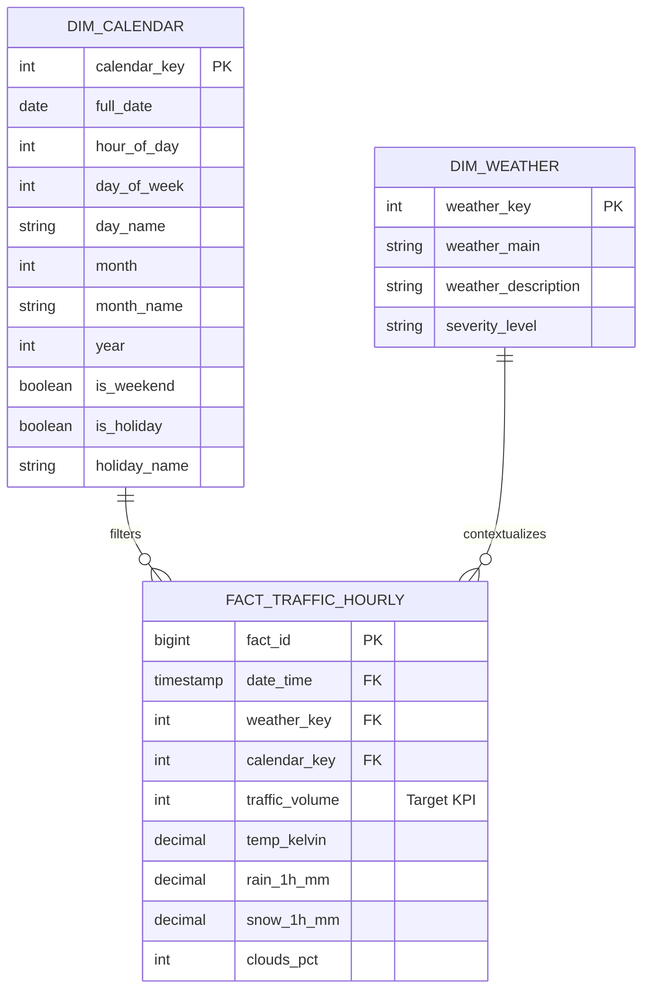

# Enterprise Data Dictionary
## Urban Mobility & Traffic Intelligence Platform

**Document Version:** 1.0.0  
**Phase:** Phase 1 — Project Foundation and Dataset Audit  
**Dataset Reference:** `data/raw/Metro_Interstate_Traffic_Volume.csv`  
**Target Domain:** Urban Transportation Engineering & Traffic Operations Intelligence  
**Geographic Scope:** Westbound Interstate 94 (I-94), Minneapolis-St. Paul, Minnesota (MN DoT ATR Station 301)  

---

## 1. Schema Overview

The dataset consists of **9 attributes** combining traffic flow measurements, temporal coordinates, and atmospheric conditions.

```
+----+---------------------+-----------------+-----------------------+---------------------+
| #  | Column Name         | Physical Dtype  | Analytical Class      | Role                |
+----+---------------------+-----------------+-----------------------+---------------------+
| 1  | holiday             | object (string) | Categorical Nominal   | Independent Feature |
| 2  | temp                | float64         | Numeric Continuous    | Independent Feature |
| 3  | rain_1h             | float64         | Numeric Continuous    | Independent Feature |
| 4  | snow_1h             | float64         | Numeric Continuous    | Independent Feature |
| 5  | clouds_all          | int64           | Numeric Discrete (%)  | Independent Feature |
| 6  | weather_main        | object (string) | Categorical Nominal   | Independent Feature |
| 7  | weather_description | object (string) | Categorical Nominal   | Independent Feature |
| 8  | date_time           | object (string) | Temporal / DateTime   | Time Dimension Key  |
| 9  | traffic_volume      | int64           | Numeric Discrete      | Primary Target KPI  |
+----+---------------------+-----------------+-----------------------+---------------------+
```

---

## 2. Detailed Attribute Specifications

### 2.1 `holiday`

- **Physical Data Type:** `object` (ASCII string)
- **Analytical Classification:** Categorical (Nominal)
- **Domain & Interpretation:** Identifies US Federal Holidays and major regional events (such as the Minnesota State Fair). When the observation date does not coincide with an official holiday, the value is populated with the string literal `'None'`.
- **Sample Values:** `'None'`, `'Labor Day'`, `'Thanksgiving Day'`, `'Christmas Day'`, `'State Fair'`
- **Missing-Value Count:** 
  - Raw CSV missing count: **0** (0.00%)
  - Default pandas `read_csv()` missing count: **48,143** (99.87%) because pandas converts the string `'None'` to `NaN`.
- **Distinct Value Count:** 12 unique values (`None`: 48,143 records; 11 holiday types: 61 records total).
- **Possible Use in Project:**
  - Feature engineering: derive binary indicator `is_holiday` (0/1).
  - SQL dimension: create `dim_holiday` lookup table.
  - Power BI: holiday vs. non-holiday traffic profile comparisons and anomaly attribution.
  - ML modeling: holiday effect modifier for commuter volume forecasting.

---

### 2.2 `temp`

- **Physical Data Type:** `float64`
- **Analytical Classification:** Continuous Numeric
- **Domain & Interpretation:** Average hourly ambient temperature recorded in **Kelvin (K)** at the collocated meteorological station.
- **Valid Physical Range:** Typically 240.0 K to 315.0 K (-33 °C to +42 °C / -27 °F to +107 °F) for Minnesota climate.
- **Sample Values:** `288.28`, `289.36`, `265.15`, `302.11`
- **Observed Range in Data:** Min: `0.00 K` | Median: `282.45 K` | Max: `310.07 K` | Mean: `281.21 K`
- **Missing-Value Count:** **0** (0.00%)
- **Data Quality Flag:** Exactly **10 records** exhibit `temp == 0.0 K` (Absolute Zero), representing sensor outage.
- **Possible Use in Project:**
  - Feature engineering: convert to Celsius (°C) and Fahrenheit (°F); derive temperature bands (Freezing, Mild, Hot).
  - Statistical analysis: correlation between ambient temperature extremes and traffic volume.
  - Predictive feature: regression input for seasonal and temperature-dependent travel demand.

---

### 2.3 `rain_1h`

- **Physical Data Type:** `float64`
- **Analytical Classification:** Continuous Numeric
- **Domain & Interpretation:** Total liquid precipitation (rain) accumulated during the 1-hour observation period, expressed in **millimeters (mm)**.
- **Sample Values:** `0.0`, `0.25`, `1.78`, `25.46`
- **Observed Range in Data:** Min: `0.00 mm` | Median: `0.00 mm` | Max: `9,831.30 mm` | Mean: `0.33 mm`
- **Missing-Value Count:** **0** (0.00%)
- **Zero-Value Frequency:** 44,737 records (92.81%) are `0.0 mm`.
- **Data Quality Flag:** Exactly **1 record** (Row 24872 on `2016-07-11 17:00:00`) contains `rain_1h = 9831.30 mm`, an erroneous sensor scale multiplier that requires capping/imputation in Phase 2.
- **Possible Use in Project:**
  - Feature engineering: derive rain intensity levels (None: 0, Light: <2.5mm, Moderate: 2.5–7.6mm, Heavy: >7.6mm).
  - Operational analytics: determine capacity reduction on I-94 during heavy rainstorm events.
  - Power BI slicer: adverse weather congestion filter.

---

### 2.4 `snow_1h`

- **Physical Data Type:** `float64`
- **Analytical Classification:** Continuous Numeric
- **Domain & Interpretation:** Total solid precipitation (snowfall) accumulated during the 1-hour observation period, expressed in **millimeters (mm)**.
- **Sample Values:** `0.0`, `0.06`, `0.25`, `0.51`
- **Observed Range in Data:** Min: `0.00 mm` | Median: `0.00 mm` | Max: `0.51 mm` | Mean: `0.0002 mm`
- **Missing-Value Count:** **0** (0.00%)
- **Zero-Value Frequency:** 48,141 records (99.87%) are `0.0 mm`. Exactly 63 records record non-zero snowfall.
- **Possible Use in Project:**
  - Feature engineering: binary flag `is_snowing` (0/1).
  - Risk assessment: winter storm traffic velocity drop and demand suppression modeling.
  - Dashboard alert: winter operations impact monitoring.

---

### 2.5 `clouds_all`

- **Physical Data Type:** `int64`
- **Analytical Classification:** Discrete Numeric / Percentage
- **Domain & Interpretation:** Total sky cover percentage observed across the celestial dome, ranging from **0%** (completely clear sky) to **100%** (completely overcast).
- **Sample Values:** `0`, `20`, `40`, `75`, `90`, `100`
- **Observed Range in Data:** Min: `0` | Q1: `1` | Median: `64` | Q3: `90` | Max: `100` | Mean: `49.36`
- **Missing-Value Count:** **0** (0.00%)
- **Possible Use in Project:**
  - Feature engineering: binning into standard meteorological cover tiers (Clear: 0–10%, Scattered: 11–50%, Broken: 51–84%, Overcast: 85–100%).
  - Correlation analysis: sky cover vs. commuter lighting conditions and traffic speed variability.

---

### 2.6 `weather_main`

- **Physical Data Type:** `object` (ASCII string)
- **Analytical Classification:** Categorical (Nominal)
- **Domain & Interpretation:** Macro meteorological classification grouping atmospheric phenomena into 11 high-level categories.
- **Allowed / Observed Categories (11 Total):**
  1. `Clear` (13,391)
  2. `Clouds` (15,164)
  3. `Drizzle` (1,821)
  4. `Fog` (912)
  5. `Haze` (1,360)
  6. `Mist` (5,950)
  7. `Rain` (5,672)
  8. `Smoke` (20)
  9. `Snow` (2,876)
  10. `Squall` (4)
  11. `Thunderstorm` (1,034)
- **Missing-Value Count:** **0** (0.00%)
- **Possible Use in Project:**
  - SQL Star Schema: dimension attribute in `dim_weather`.
  - Dashboard: primary category slicer for weather-segmented traffic charts in Power BI.
  - ML Pipeline: one-hot or target encoding feature.

---

### 2.7 `weather_description`

- **Physical Data Type:** `object` (ASCII string)
- **Analytical Classification:** Categorical (Nominal)
- **Domain & Interpretation:** Detailed micro-level meteorological description providing fine-grained observation detail.
- **Distinct Value Count:** 38 categories (e.g., `'sky is clear'`, `'mist'`, `'overcast clouds'`, `'moderate rain'`, `'proximity thunderstorm'`).
- **Sample Values:** `'light rain'`, `'heavy snow'`, `'scattered clouds'`, `'freezing rain'`
- **Missing-Value Count:** **0** (0.00%)
- **Data Quality Flag:** Inconsistent text casing (`'sky is clear'` vs. `'Sky is Clear'`, `'SQUALLS'`) requiring normalization.
- **Possible Use in Project:**
  - Advanced diagnostic analysis: extreme weather sub-tier breakdown.
  - Power BI tooltip detail and secondary hierarchy drill-down under `weather_main`.

---

### 2.8 `date_time`

- **Physical Data Type:** `object` (ISO-8601-like string format: `YYYY-MM-DD HH:MM:SS`)
- **Analytical Classification:** Temporal / DateTime Dimension Key
- **Domain & Interpretation:** The calendar date and hour of observation in local Minneapolis time (Central Standard Time / Central Daylight Time).
- **Temporal Boundary:** From `2012-10-02 09:00:00` through `2018-09-30 23:00:00`.
- **Parsing Rate:** 100% convertible to datetime without errors or NaT values.
- **Missing-Value Count:** **0** (0.00%)
- **Key Characteristics:** 
  - 40,575 unique timestamps.
  - 5,445 timestamps contain multiple rows due to concurrent weather observations.
  - Contains an extended 307-day gap from August 2014 to June 2015.
- **Possible Use in Project:**
  - Primary time-series index.
  - Date dimension extraction: `year`, `quarter`, `month`, `day`, `day_of_week`, `hour`, `is_weekend`, `rush_hour_flag`.
  - Join key for relational dimensional modeling in SQL.
  - Date hierarchy definition in Power BI model.

---

### 2.9 `traffic_volume`

- **Physical Data Type:** `int64`
- **Analytical Classification:** Continuous Numeric (Discrete Vehicle Count)
- **Domain & Interpretation:** **Primary Target Metric.** Total westbound vehicular traffic volume recorded across all travel lanes at the I-94 automated recording gantry during the 1-hour interval.
- **Sample Values:** `5545`, `4516`, `4767`, `1042`, `350`
- **Observed Range in Data:** Min: `0` | Q1: `1,193` | Median: `3,380` | Q3: `4,933` | Max: `7,280` | Mean: `3,259.82` | Std Dev: `1,986.86`
- **Distribution Shape:** Bimodal distribution (commuting rush hours vs. overnight lull), skewness `-0.089`, kurtosis `-1.309`.
- **Missing-Value Count:** **0** (0.00%)
- **Possible Use in Project:**
  - Target variable $y$ for supervised regression and time-series forecasting.
  - Primary operational performance indicator in SQL analytical views.
  - Core DAX measure for all Power BI reporting (Total Volume, Average Hourly Volume, Peak Hourly Volume, YoY Variance).

---

## 3. Dimensional Modeling Blueprint (Target Architecture Preview)


