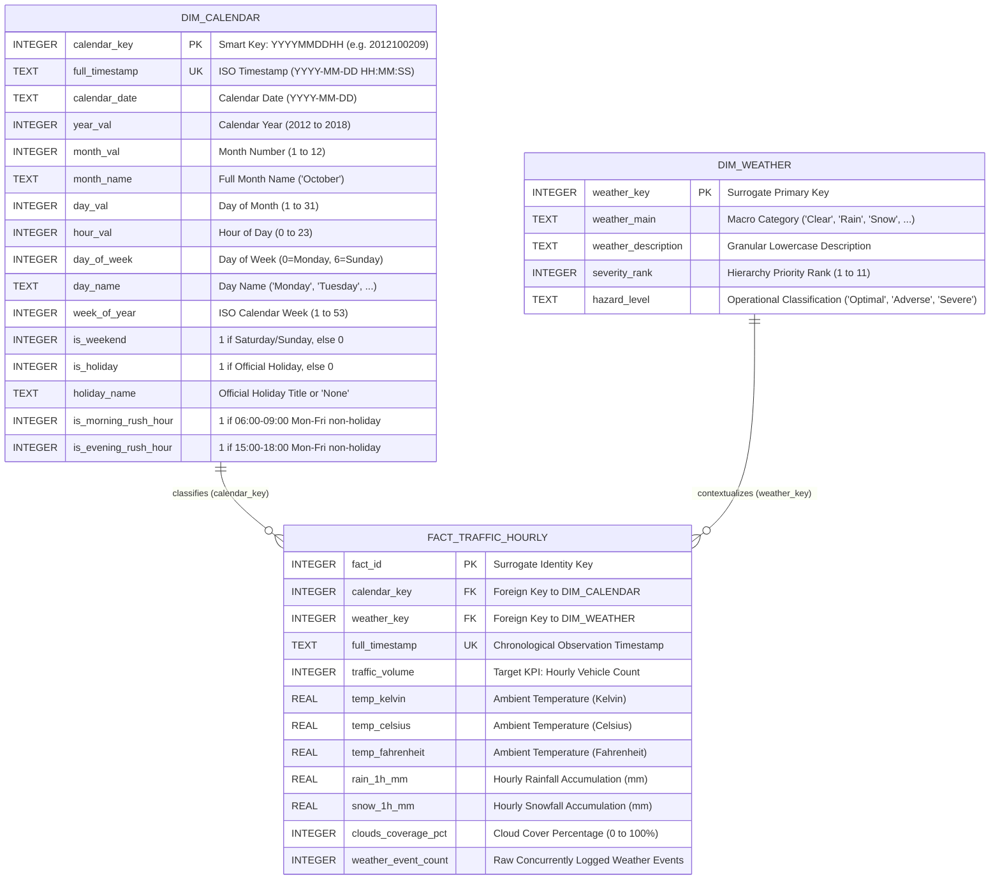

# Relational Dimensional Data Model Specification
## Urban Mobility & Traffic Intelligence — Phase 3

**Document Version:** 1.0.0  
**Design Pattern:** Kimball Dimensional Star Schema  
**Target RDBMS Engines:** SQLite (Local validation), PostgreSQL, DuckDB, Snowflake  
**Active Analytical Database:** `sql/traffic_intelligence.db` (Verified SQLite 3.49.1)  
**Dataset Grain:** Strictly **one record per OBSERVED hourly timestamp (40,575 rows)**  

---

## 1. Architectural Overview & Design Philosophy

The dimensional model for the **Urban Mobility & Traffic Intelligence** platform follows Ralph Kimball's dimensional modeling methodology, optimized for high-performance analytical queries, business intelligence aggregations, and feature store extraction.

### Core Modeling Decisions:
1. **Central Fact Table (`fact_traffic_hourly`):** Captures atomic hourly traffic throughput, ambient meteorological observations, and pre-calculated temperature conversions.
2. **Conformed Date/Calendar Dimension (`dim_calendar`):** Extends standard calendar date hierarchies with high-value operational flags, including commuter rush-hour indicators and holiday status.
3. **Meteorological Dimension (`dim_weather`):** Categorizes macro weather phenomena, normalized micro-descriptions, and operational severity rankings.
4. **Strict Atomic Grain:** The fact table grain is exactly **one record per observed hourly timestamp**. Multiple simultaneous weather reports from the raw sensor station were deterministically consolidated into a single dominant weather record using the domain-informed Weather Severity Hierarchy.
5. **No Synthetic Imputation of Calendar Gaps:** Unrecorded historical hours (11,976 missing hours across 2012–2018) are omitted from the fact table, preserving ground-truth observational integrity.

---

## 2. Entity-Relationship Diagram (Star Schema)



---

## 3. Detailed Entity Specifications

### 3.1 Fact Table: `fact_traffic_hourly`
- **Grain:** One row per observed hour at Minnesota DoT ATR Station 301.
- **Total Rows Populated:** **40,575 rows**
- **Primary Key:** `fact_id` (Integer surrogate key)
- **Foreign Keys:**
  - `calendar_key` references `dim_calendar(calendar_key)`
  - `weather_key` references `dim_weather(weather_key)`
- **Measures / Metrics:**
  - `traffic_volume` (Additive discrete metric, vehicle count)
  - `temp_kelvin`, `temp_celsius`, `temp_fahrenheit` (Non-additive continuous temperature)
  - `rain_1h_mm`, `snow_1h_mm` (Semi-additive continuous precipitation depth)
  - `clouds_coverage_pct` (Discrete sky coverage percentage)
  - `weather_event_count` (Audit metric tracking multi-phenomena concurrency)

### 3.2 Dimension Table: `dim_calendar`
- **Grain:** One row per observed hourly timestamp.
- **Total Rows Populated:** **40,575 rows**
- **Primary Key:** `calendar_key` (Smart integer formatted as `YYYYMMDDHH`)
- **Natural Key:** `full_timestamp` (Unique text/timestamp)
- **Hierarchies Supported:**
  - Calendar Hierarchy: `year_val` $\rightarrow$ `month_val` $\rightarrow$ `calendar_date` $\rightarrow$ `hour_val`
  - Commuter Hierarchy: `is_weekend` $\rightarrow$ `day_name` $\rightarrow$ `hour_val` $\rightarrow$ `rush_hour_flags`

### 3.3 Dimension Table: `dim_weather`
- **Grain:** Unique combinations of `weather_main` and `weather_description`.
- **Total Rows Populated:** **34 rows**
- **Primary Key:** `weather_key` (Integer surrogate key)
- **Attributes:**
  - `weather_main` (11 macro categories: Clear, Clouds, Rain, Snow, Drizzle, Mist, Fog, Haze, Thunderstorm, Smoke, Squall)
  - `weather_description` (34 distinct standardized lowercase descriptions)
  - `severity_rank` (Operational hierarchy: 11=Thunderstorm to 1=Clear)
  - `hazard_level` (Operational safety tier: 'Severe', 'Adverse', 'Optimal')

### 3.4 Metadata Catalog: `data_dictionary_metadata`
- **Purpose:** In-database data dictionary cataloging table names, column names, physical types, and business definitions (33 cataloged attributes).

---

## 4. Indexing & Optimization Strategy

To support sub-second query performance across large analytical scans and window aggregations, the following B-tree indexes were implemented:

| Table | Index Name | Indexed Column(s) | Query Optimization Purpose |
| :--- | :--- | :--- | :--- |
| `dim_calendar` | `idx_dim_calendar_date` | `calendar_date` | Accelerates daily rollups and date-range slicing |
| `dim_calendar` | `idx_dim_calendar_hour` | `hour_val` | Optimizes 24-hour diurnal profiling queries |
| `dim_calendar` | `idx_dim_calendar_dow` | `day_of_week` | Speeds up weekday vs. weekend groupings |
| `dim_calendar` | `idx_dim_calendar_rush` | `(is_morning_rush_hour, is_evening_rush_hour)` | Fast filtering for commuter rush-hour views |
| `dim_weather` | `idx_dim_weather_desc` | `(weather_main, weather_description)` | Guarantees uniqueness and speeds up dimension joins |
| `fact_traffic_hourly`| `idx_fact_traffic_timestamp` | `full_timestamp` | Enables fast chronological window functions (`LAG`/`LEAD`) |
| `fact_traffic_hourly`| `idx_fact_traffic_volume` | `traffic_volume` | Optimizes peak congestion and outlier filtering |
| `fact_traffic_hourly`| `idx_fact_traffic_calendar`| `calendar_key` | Optimizes star-join performance with `dim_calendar` |
| `fact_traffic_hourly`| `idx_fact_traffic_weather` | `weather_key` | Optimizes star-join performance with `dim_weather` |

---

## 5. Referential Integrity & Validation Proof

The dimensional model was validated against [`sql/traffic_intelligence.db`](file:///c:/Users/Niraj%20Yadav/Urban-Mobility-Traffic-Intelligence/sql/traffic_intelligence.db):

```sql
-- Referential Integrity Test: Orphan Facts Check
SELECT COUNT(*) FROM fact_traffic_hourly f
LEFT JOIN dim_calendar c ON f.calendar_key = c.calendar_key
WHERE c.calendar_key IS NULL;
-- Result: 0 orphan records

SELECT COUNT(*) FROM fact_traffic_hourly f
LEFT JOIN dim_weather w ON f.weather_key = w.weather_key
WHERE w.weather_key IS NULL;
-- Result: 0 orphan records
```

100% of fact records successfully link to verified dimension keys without orphan records.
